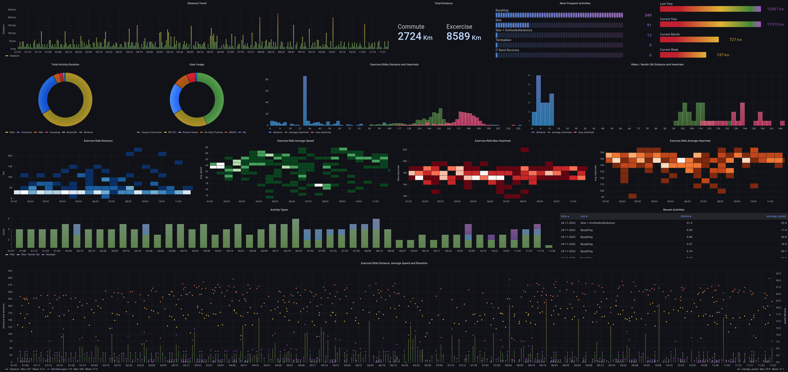
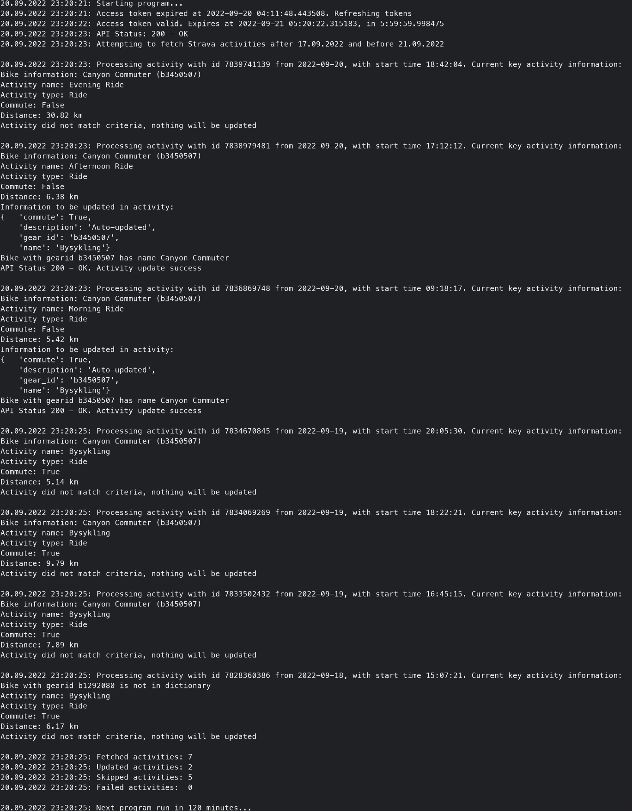

# About
The Python code in this folder use Strava's activities API. The main purpose is to retrieve personal activity and store it locally in order to do analysis and visualistion beyond what is offered by Strava. Second, the code also makes it possible to automatically update activities meeting certain criteria. This can be useful if you for instance want consistent naming of commuting activities.

# Info about executables and parameter files in this folder
- `send_strava.py`
Uses Strava activities API to retrieve rides for a specified athlete for the last three days. Once the data is received, the module modifies the data structure and publishes the data to a MQTT topic. Contains loops so it runs repeatedly, e.g. in a container or through systemd
- `send_strava_manual.py`
Same as `send_strava.py`, execpt that it accepts a date range as input and runs only once
- `update_strava.py`
Uses Strava activities API to update recent activities based on user defined criteria
- `oauth_helper.py`
Uses Strava oauth endpoint to retrieve initial access tokens
- `create-container-send-strava.sh`
Sends commands to the Docker engine to create image and container and to run the container with the `send_strava.py` module
- `create-container-update-strava.sh`
Sends commands to the Docker engine to create image and container and to run the container with the `update_strava.py` module
- `send-strava-requirements.txt`
Information about Python packages to be included in the docker image for the `send_strava.py` module
- `update-strava-requirements.txt`
Information about Python packages to be included in the docker image for the `update_strava.py` module
- `strava_tokens.json`
User specific information needed to authorize with Strava's APIs
- `strava_gear.json`
User specific information needed to update gear in a given ride
- `send-strava.Dockerfile`
Instructions to the docker daemon for building image for the `send_strava.py` module
- `update-strava.Dockerfile`
Instructions to the docker daemon for building image for the `update_strava.py` module

# Configuration instructions
Except `oauth_helper.py` and `send_strava_manual.py`, which are written to be run ad-hoc, its best to run the modules either through [systemd](https://en.wikipedia.org/wiki/Systemd) or Docker. This will ensure that the scripts runs continously and you will also get some built-in error handling, e.g. automatic restart if something unexpected happens. The code in this folder assumes Docker engine is running.

>*I made this code to hone my Python skills and to experiment with Strava's API. As such there may be flaws and choices in the code that could represent issues with information security. Strava API accesses real data, i.e. actual activity data, so keep this in mind if you would like to use this code*

## Prerequisites for all modules
1. Copy the files in this folder to your environment. Best would be to clone the entire repository with Git, so you receive updates when the code is improved
2. You must have access to Strava's activities API for these modules to work. Strava has a [developer portal](https://developers.strava.com/) that provides all the necessary instructions to get started. In particular, you need to obtain credentials from Strava to get the oauth2 process going. This basically means that you need to [complete a form](https://strava.com/settings/api) available at Strava's developer portal and then use the info from that step to retrieve oauth tokens. Tekk Sparrow Program has made an excellent [Youtube-tutorial](https://www.youtube.com/watch?v=MrODoLLkM5E) on how to do this and even [provided a script](https://github.com/tekksparrow-programs/simple-api-strava/blob/main/simple-api-strava.py). You can also use the `oauth2_helper.py` script in this folder, which is directly based on the one written by Tekk Sparrow Programs. Strava also has a nice [step-by-step guide](https://developers.strava.com/docs/getting-started/#oauth) that explains the process.
3. Modify `strava_tokens.json` with the info returned from the script you ran in the previous step. This is a one time process. Once this is done, the modules in this folder will use refresh tokens to automatically update your access token when it expires.

## Configuration of send_strava.py and send_strava_manual.py
1. Modify the shell script `create-container-send-strava.sh` according to suit your environment, e.g. with information about the MQTT broker, location of the oauth tokens etc
4. Run the shell script `create-container-send-strava.sh`. This will create a image and then a container based on that image and run the container 

The `send_strava_manual.py` script requires the same parameters as the container version of the script, but as the script only runs ad-hoc its easier to just input the parameters whenever you need to run the script, typically to retrieve a batch of Strava activities.

**Overview of the main components**

Both scripts send data to a MQTT topic and as such do not need to persist data themselves. MQTT is freely available and can for example be run as a [Docker container](https://hub.docker.com/_/eclipse-mosquitto)
Only creativity limits what is possible to do with those data, once they are published to the topic. For instance you could light up a led when a certain weekly distance is reached, or you could have another piece of code that subscribes to the topic, writes the data to MariaDB and visualises it in Grafana. Information about that code will follow later. But for now, here is an example of how that could look

## Configuration of update_strava.py
1. Find the section for user variables in `update_strava.py`, around line 127, and adjust as needed, e.g. with activity title, description and gear id
2. Update `strava_gear.json` with gear id and name of gear. The gear id can be found either through the Strava website, check the URL, or by inspecting the json response from the activities API
3. Run the shell script `create-container-update-strava.sh`. This will create a image and then a container based on that image and run the container

**Sample output produced when the script runs**

